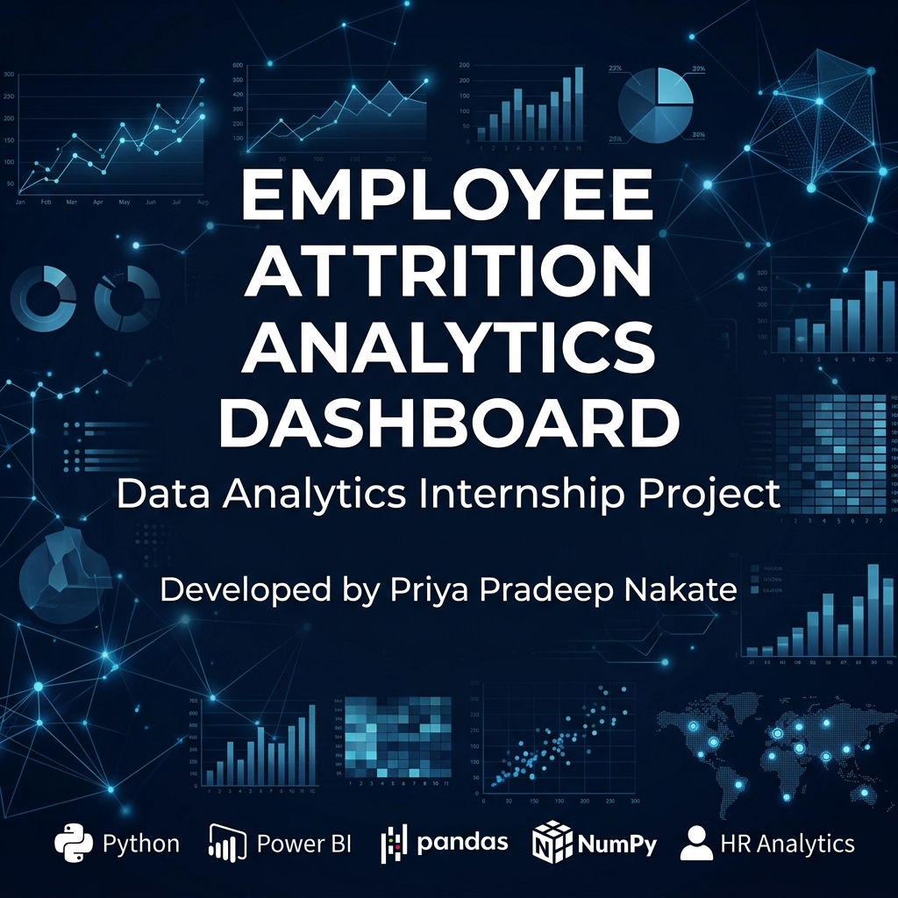

# Employee Attrition Analytics Dashboard
### Business Intelligence | HR Analytics | Power BI | Python
**Developed by Priya Pradeep Nakate**  
*Data Analytics Intern, SyntecxHub*  
*Project Duration: 01 June 2026 – 07 June 2026*  

---

## Executive Summary
This project delivers an end-to-end business intelligence and data analytics solution to address employee attrition at SyntecxHub. Voluntary employee turnover represents a significant expense for organizations, with direct replacement costs estimated at 50% to 200% of an employee's annual salary when accounting for recruitment, onboarding, and lost productivity. 

Using Python for data processing, validation, and exploratory data analysis (EDA), and Microsoft Power BI for interactive dashboard design, this project analyzes a workforce of 1,470 employees to diagnose the primary drivers of voluntary departures. Key findings indicate that **overtime is the strongest predictor of attrition**, with employees working overtime experiencing a **30.5% turnover rate** compared to **10.4%** for those who do not. Additionally, entry-level roles—specifically **Sales Representatives (39.8% attrition)** and **Laboratory Technicians (23.9% attrition)**—exhibit high turnover. These operational signals, combined with a **$24,000 median annual salary gap** between departing and retained staff, form the basis for strategic, data-driven HR recommendations designed to improve retention, reduce burnout, and stabilize the workforce.

This project demonstrates core competencies in **Data Analysis**, **Data Cleaning**, and **Exploratory Data Analysis (EDA)** using **Python** (**Pandas** and **NumPy**), combined with interactive **Dashboard Development** and **Data Visualization** in **Power BI** for actionable **Workforce Analytics** and **KPI Reporting**.

---

## Project Highlights
*   **1,470 Workforce Records Analyzed:** Processed and validated employee datasets to identify demographic and operational attrition trends.
*   **5-Page Interactive Dashboard Blueprint:** Developed a structured reporting layout in Power BI to track key organizational metrics.
*   **15+ Dynamic HR KPIs & Measures:** Programmed explicit DAX calculations for metrics including Attrition Rate %, Overtime Rate %, Active Headcount, and Salary Gaps.
*   **8 Executive-Level Data Visualizations:** Exported targeted exploratory analysis charts using Matplotlib and Seaborn in Python.
*   **End-to-End Analytics Workflow:** Executed a structured project lifecycle encompassing Python data cleaning, Power BI modeling, and executive report writing.
*   **5 Targeted HR Retention Strategies:** Delivered business recommendations focusing on overtime burnout, junior role career paths, and compensation equity.

---

## Skills Demonstrated

| Technical Skills | Analytics Skills | Business Skills |
| :--- | :--- | :--- |
| • Python (Data Analysis)<br>• Pandas (Data Manipulation)<br>• NumPy (Numerical Ops)<br>• Power BI (Business Intelligence)<br>• Data Visualization (Matplotlib, Seaborn) | • Data Cleaning & Validation<br>• Exploratory Data Analysis (EDA)<br>• KPI Analysis & Design<br>• Dashboard Design & UX<br>• Business Reporting & Documentation | • HR Analytics / Workforce Analytics<br>• Attrition Analysis / Turnover Driver Auditing<br>• Decision Support Systems<br>• Data Storytelling & Stakeholder Comm |

---

## Business Problem
High employee turnover creates significant challenges for organizations, impacting financial performance, operational continuity, and team morale. SyntecxHub requires a data-driven approach to:
1.  **Quantify Attrition Costs:** Identify the roles, departments, and demographics contributing most to voluntary turnover.
2.  **Expose Operational Burnout:** Measure the relationship between overtime hours, work-life balance ratings, and attrition.
3.  **Audit Compensation structures:** Evaluate the impact of salary disparities, promotion timelines, and salary hikes on retention.
4.  **Optimize HR Retention Strategies:** Transition from reactive hiring to proactive, targeted retention programs.

---

## Project Objectives
*   **Establish Data Quality:** Clean, standardize, and validate the raw dataset to ensure zero duplicates or missing values.
*   **Isolate Key Attrition Drivers:** Perform exploratory data analysis in Python using statistical correlations and visualizations.
*   **Design a Professional-Grade Dashboard:** Construct an interactive, 5-page Power BI dashboard blueprint to present key metrics and enable drill-down capabilities for business leaders.
*   **Provide Strategic Recommendations:** Translate data-driven findings into actionable, cost-effective HR policies to reduce turnover.

---

## Dataset Overview
The project utilizes the verified IBM HR Analytics Employee Attrition & Performance dataset, representing a workforce of **1,470 employees** across 35 features. 

### Enriched & Engineered Columns:
During the data cleaning pipeline (`data_cleaning.py`), three engineered features were created to enhance the depth of analysis:
*   `Salary`: Derived by annualizing monthly income (`MonthlyIncome` * 12) to align with standard compensation review processes.
*   `Age Group`: Binned into five cohorts (`18-25`, `26-35`, `36-45`, `46-55`, `55+`) to analyze career stage impact.
*   `Recently Promoted`: A binary indicator (`Yes`/`No`) based on whether the employee was promoted within the past 2 years (`YearsSinceLastPromotion <= 2`).

### Removed Features (Zero Variance):
Three columns with constant values across all rows were removed to optimize model size: `EmployeeCount` (always 1), `StandardHours` (always 80), and `Over18` (always 'Y').

---

## Technology Stack
*   **Data Processing & ETL:** Python 3.12, Pandas, NumPy
*   **Data Visualization & EDA:** Matplotlib, Seaborn
*   **Business Intelligence & Dashboarding:** Microsoft Power BI Desktop (DAX, Power Query)
*   **Documentation:** Markdown
*   **Version Control:** Git

---

## Project Architecture
The project follows a modular data engineering and business intelligence workflow:

```
[Raw HR Dataset] (CSV)
       │
       ▼
[Data Cleaning Pipeline] (data_cleaning.py)
       │  ├── Handle Data Types & Rename ID
       │  ├── Prune Zero-Variance Features
       │  └── Feature Engineering (Salary, Age Group, Recently Promoted)
       │
       ▼
[Processed Dataset] (cleaned_employee_data.csv)
       │
       ├─────────────────────────────────────────┐
       ▼                                         ▼
[Exploratory Data Analysis] (Python / Jupyter)  [Power BI Executive Dashboard]
       │  ├── Statistical Correlations           ├── Star-Schema Data Model
       │  ├── Demographic Segmentation           ├── KPI Callouts (DAX Measures)
       │  └── Export 8 Executive PNG Charts      └── 5 Interactive Report Pages
       │                                         │
       └────────────────────┬────────────────────┘
                            ▼
               [Strategic Business Insights]
                            ▼
               [Executive HR Recommendations]
```

---

## Key KPIs

The table below outlines the core metrics calculated from the cleaned dataset:

| KPI Category | Metric Description | Value | Analysis & Context |
| :--- | :--- | :---: | :--- |
| **Workforce Size** | Total Headcount | 1,470 | Baseline headcount of the organization |
| **Stability** | Active Employees | 1,233 | Total retained employees |
| **Retention** | Overall Attrition Rate | 16.1% | 237 employees voluntarily departed |
| **Compensation** | Average Annualized Salary | $78,035 | Organization-wide average salary |
| **Tenure** | Average Experience | 11.3 years | Average tenure/working years |
| **Operational** | Overtime Rate | 28.3% | 416 employees regularly work overtime |
| **Departmental** | Sales Attrition Rate | 20.6% | Highest turnover department |
| **Departmental** | HR Attrition Rate | 19.0% | Moderate turnover department |
| **Departmental** | R&D Attrition Rate | 13.8% | Most stable department |

---

## Dashboard Interface & Previews
The project design features a 5-page, high-contrast dashboard following professional UI/UX standards:
*   **Theme:** Deep Navy (`#0F172A`) headers, Teal (`#0D9488`) stable metrics, Coral (`#F43F5E`) attrition callouts, and Slate Grey (`#64748B`) secondary bars.
*   **Canvas Size:** Widescreen 16:9 (`1280 x 720` pixels).

### ⚠️ Dashboard Preview Coming Soon
To view the visual pages of this dashboard, please follow the instructions below to capture and place the screenshots in the repository.

#### Screenshot Previews & Placeholders:
1.  **Page 1: Executive Overview**
    *   **File Path:** `dashboard/screenshots/01_Executive_Overview.png`
    *   **Layout details:** Total Headcount, Attrition Count, Attrition Rate %, Retention Rate %, Avg Salary, Avg Experience cards; Departmental Attrition rate columns; Overtime Attrition Rate columns; Department & Job Role summary matrix table.
2.  **Page 2: Attrition Analysis**
    *   **File Path:** `dashboard/screenshots/02_Attrition_Analysis.png`
    *   **Layout details:** Job Role Attrition Rate descending horizontal bars; Work-Life Balance vs. Attrition 100% stacked columns; Promotion Recency vs. Attrition columns.
3.  **Page 3: Employee Demographics**
    *   **File Path:** `dashboard/screenshots/03_Demographics.png`
    *   **Layout details:** Age Group Attrition columns; Education Field headcount/attrition bars; Marital Status & Gender demographic matrix.
4.  **Page 4: Salary & Compensation**
    *   **File Path:** `dashboard/screenshots/04_Salary_Compensation.png`
    *   **Layout details:** Salary Bands (<$50k, $50k-100k, $100k-150k, >$150k) headcount/attrition columns; Salary Hike vs. Annual Salary scatter plot; Stock Option Level attrition rate columns.
5.  **Page 5: Strategic Recommendations**
    *   **File Path:** `dashboard/screenshots/05_Recommendations.png`
    *   **Layout details:** Job Role vs. Overtime attrition rate matrix (conditional formatting); interactive HR action checklist cards.

---

### Instructions: How to Add Dashboard Screenshots
If you have built the dashboard in Power BI, follow these steps to display your pages here:
1.  Open your Power BI Desktop file (`.pbix`).
2.  Navigate to each of the 5 pages.
3.  Use a screenshot tool (e.g., Snipping Tool or Win+Shift+S) to capture each full page at widescreen resolution.
4.  Save each screenshot using the exact filenames listed below:
    *   `dashboard/screenshots/01_Executive_Overview.png`
    *   `dashboard/screenshots/02_Attrition_Analysis.png`
    *   `dashboard/screenshots/03_Demographics.png`
    *   `dashboard/screenshots/04_Salary_Compensation.png`
    *   `dashboard/screenshots/05_Recommendations.png`
5.  Commit and push the files to your GitHub repository. They will automatically render in the README section below:

#### 1. Page 1: Executive Overview


#### 2. Page 2: Attrition Analysis


#### 3. Page 3: Employee Demographics


#### 4. Page 4: Salary & Compensation


#### 5. Page 5: Strategic Recommendations


---

## Insights & Findings

### 1. Overtime Burnout
*   **Finding:** Employees working overtime experience a **30.5% attrition rate**, compared to **10.4%** for those who do not. Overtime is the strongest single driver of voluntary turnover in the organization.
*   **Context:** Heavy workloads and frequent overtime are strongly associated with burnout, leading to a high attrition rate among affected employees.

### 2. High-Risk Roles & Early-Career Churn
*   **Finding:** **Sales Representatives** show a high attrition rate of **39.8%**, followed by Laboratory Technicians at **23.9%** and HR Specialists at **23.1%**.
*   **Context:** Employees in the **18-25 age group** experience a **36.2% attrition rate**. Entry-level roles with high pressure, low control, and limited early career progression are highly susceptible to early churn.

### 3. Salary Disparities
*   **Finding:** Retained staff have a median annual salary of **$62,400**, whereas departing employees have a median of **$38,520**—representing a **$23,880 annual pay gap**.
*   **Context:** Lower compensation ranges correlate with higher attrition rates, highlighting the need to evaluate starting salaries.

### 4. Managerial Stability
*   **Finding:** Correlation analysis shows that longer tenures under the same manager (`YearsWithCurrManager`) correlate with lower attrition rates.
*   **Context:** Supportive, stable leadership is a key driver of employee retention, indicating that manager-employee alignment plays an important role in workforce stability.

---

## Business Recommendations

### 1. Implement Overtime Audits & Burnout Controls
*   **Action:** Establish weekly overtime thresholds per employee. Implement automated alerts in time-tracking software when employees exceed 10 hours of overtime per week.
*   **Mitigation:** Introduce a "Time Off in Lieu" (TOIL) policy, allowing employees to exchange overtime hours for flexible rest days, helping to prevent burnout.

### 2. Restructure Sales Representative Compensation & Career Paths
*   **Action:** Conduct a salary review for Sales Representatives. Shift the compensation structure to increase base salaries while adjusting commission structures to remain competitive.
*   **Mitigation:** Define clear, performance-based promotion pathways within the first 12 to 18 months, reducing the high turnover observed in the 18-25 age group.

### 3. Establish Targeted Retention Plans for High-Risk Cohorts
*   **Action:** Introduce structured mentorship programs matching entry-level employees with senior leaders to improve organizational connection.
*   **Mitigation:** Conduct quarterly check-ins for high-risk roles (Sales Reps, Laboratory Technicians) to address career development and role satisfaction before annual reviews.

### 4. Standardize Promotion and Career Planning Reviews
*   **Action:** Leverage the `Recently Promoted` metric by establishing regular career reviews for employees who have not been promoted within 3 years.
*   **Mitigation:** Create horizontal career paths or technical specialist tracks to allow growth opportunities for employees who may not want to move into management roles.

### 5. Enhance Leadership and Managerial Training
*   **Action:** Provide line managers with training on employee engagement, burnout recognition, and supportive feedback models.
*   **Mitigation:** Conduct anonymous 360-degree feedback reviews for teams with high attrition rates to address potential management-driven turnover.

---

## Future Enhancements
*   **Predictive Attrition Modeling:** Integrate a machine learning classification model (e.g., Random Forest, XGBoost) to calculate individual employee attrition risk scores.
*   **Automated Data Pipeline:** Set up an ETL pipeline connecting the cleaning script to SQL databases to automate data updates.
*   **Qualitative Feedback Integration:** Ingest text data from exit interviews and conduct sentiment analysis to identify qualitative drivers of attrition.

---

## Project Structure
```
Employee-Attrition-Analytics/
│
├── .gitignore                      # Git exclusion file
├── LICENSE                         # MIT License file
├── CONTRIBUTING.md                 # Contribution guidelines
├── CHANGELOG.md                    # Project changelog and history
├── README.md                       # Master portfolio documentation (this file)
├── PROJECT_OVERVIEW.md             # Recruiter-facing executive project overview
├── requirements.txt                # Python package dependencies
├── linkedin_post.txt               # LinkedIn post copy template
│
├── data/
│   ├── raw_employee_data.csv        # Raw dataset from IBM (1,470 records)
│   ├── cleaned_employee_data.csv    # Cleansed and enriched dataset
│   └── data_cleaning.py             # Python script for ETL pipeline
│
├── notebooks/
│   ├── employee_attrition_analysis.ipynb  # Interactive Jupyter Notebook
│   └── generate_charts.py           # Python script to export EDA charts
│
├── dashboard/
│   ├── Power_BI_Dashboard_Guide.md  # Detailed Power BI architecture guide
│   └── screenshots/                 # Folder for actual Power BI screenshots (placeholders inside README)
│
├── images/
│   ├── portfolio_banner.png         # Sleek project banner image
│   ├── attrition_by_age_group.png   # Age cohort chart
│   ├── attrition_by_dept.png        # Departmental breakdown
│   ├── attrition_by_role.png        # Role-based turnover
│   ├── correlation_heatmap.png      # Numerical correlation heatmap
│   ├── gender_vs_attrition.png      # Gender analysis
│   ├── overtime_vs_attrition.png     # Overtime analysis
│   ├── salary_vs_attrition.png      # Annual salary box plot
│   ├── work_life_balance_vs_attrition.png # Work-life balance chart
│   └── dashboard_mockup.png         # Power BI dashboard layout mockup
│
└── report/
    ├── Executive_Report.md          # Business executive summary
    ├── Business_Insights_Report.md # Analytical breakdown
    ├── Project_Summary.md           # Scope and timeline summary
    ├── Technical_Documentation.md   # System architecture
    ├── Internship_Report.md         # Final academic internship report
    ├── Recruiter_Evaluation.md      # Analyst score assessment
    ├── Resume_Bullet_Points.md      # Quantified resume/LinkedIn bullet points
    ├── Project_Talking_Points.md    # Target-specific project presentation scripts
    └── Interview_Questions.md       # 30 detailed project-defense questions and answers
```

---

## Installation Guide
1. Clone the repository to your local machine:
   ```bash
   git clone https://github.com/Priyan2520/Employee-Attrition-Analytics.git
   cd Employee-Attrition-Analytics
   ```
2. Create a virtual environment and activate it:
   ```bash
   python -m venv venv
   # On Windows:
   venv\Scripts\activate
   # On macOS/Linux:
   source venv/bin/activate
   ```
3. Install the dependencies:
   ```bash
   pip install -r requirements.txt
   ```

---

## How To Run
*   **Run Data Cleaning Pipeline:**
    ```bash
    python data/data_cleaning.py
    ```
    This script loads the raw dataset, processes variables, applies logic, and exports `cleaned_employee_data.csv` to the `data/` folder.
*   **Regenerate Charts:**
    ```bash
    python notebooks/generate_charts.py
    ```
    This script generates the 8 executive-level visualizations and saves them in the `images/` folder.
*   **Open Interactive Notebook:**
    ```bash
    jupyter notebook notebooks/employee_attrition_analysis.ipynb
    ```

---

## Author Section
**Priya Pradeep Nakate**  
*Data Analytics Intern | SyntecxHub*  

*   **GitHub:** [github.com/Priyan2520](https://github.com/Priyan2520)
*   **LinkedIn:** [linkedin.com/in/priya-nakate](https://linkedin.com/in/priya-nakate) (Replace with your actual profile URL)
*   **Email:** priya.nakate@example.com (Replace with your professional email)
